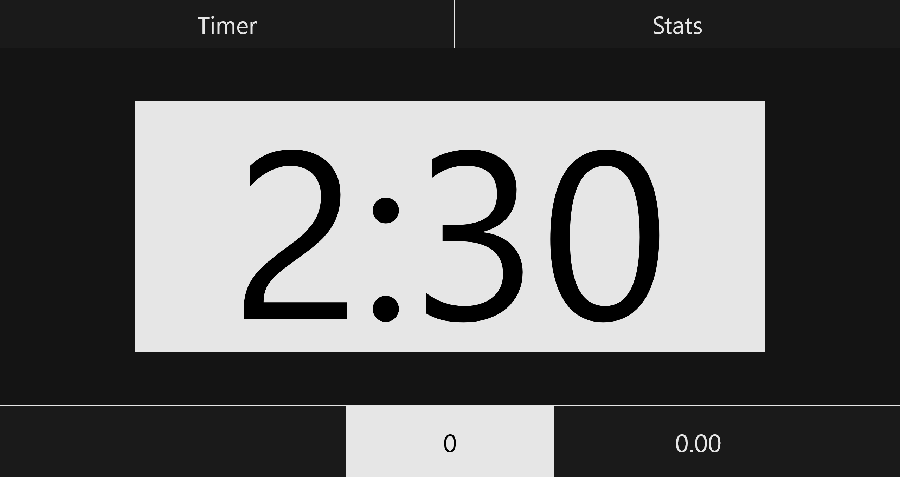
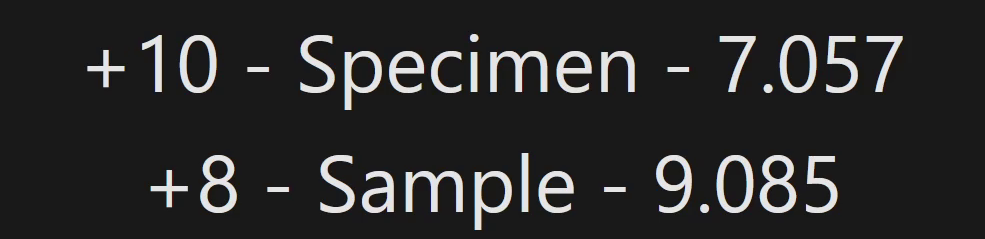
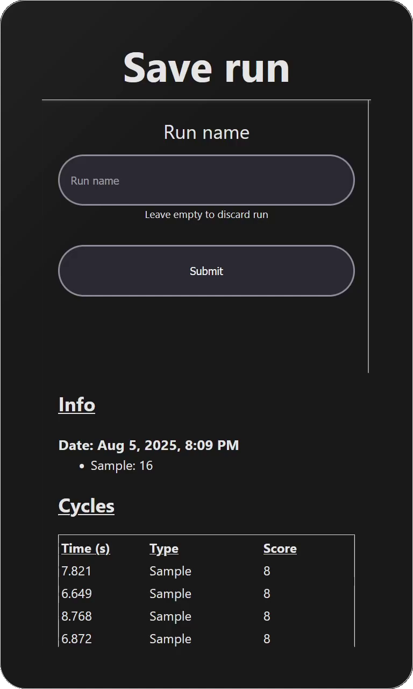
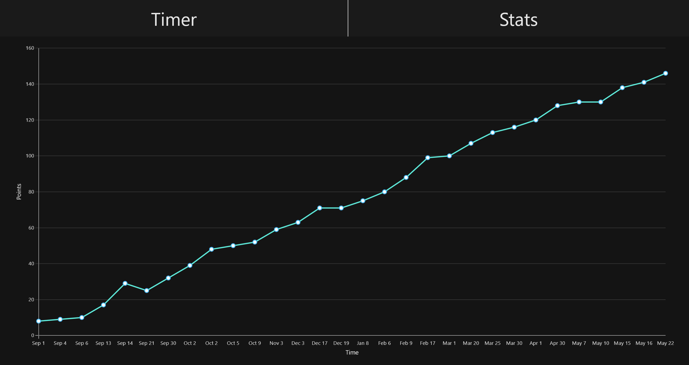

# FTC Practice App
FTC Practice App is a web app designed to improve your driving performance

Developed by KNOTbot 22817


# Features
## Key features
- Easy to use interface with an FTC-like design
- Automatically keep track of points
- Record cycle times with millisecond precision
- View past run data to track progress
## Extra features
- Label runs with custom identifiable names
- View advanced statistics including mean cycle time and scoring rate
- Play real FTC match sounds
- Show a warning when starting early or ending matches late
- Synchronize with multiple devices

# Installation
1. Open `build.dependencies.gradle` in the root of your project
2. Add `maven { url 'https://jitpack.io' }` at the bottom of the `repositories` section
```groovy
repositories {
	// ...

	maven { url 'https://jitpack.io' }
}
```
3. Add the practice app in the `dependencies` section
```groovy
depdencies {
	// ...

	implementation 'com.github.22817-knotbot:ftc-practice-app:0.1.0-alpha'
}
```

&nbsp;
# Usage
## Programming
All the functions you will need are static methods from the `RobotEvent` class.

Start by importing the class:

```java
import com.knotbot.practiceapp.RobotEvent;
```

&nbsp;\
When you start the match period, run the respective method
- `startAuto()` for Auto
- `startTransition()` for transition between Auto and TeleOp
- `startTeleOp()` for TeleOp

```java
// This example is for a LinearOpMode, but the same functions can be used similarly in an OpMode
@Override
public void runOpMode() {
  waitForStart();
  RobotEvent.startAuto(); // If it is an Autonomous program, run this
  // RobotEvent.startTeleop(); // If it is a TeleOp program, run this instead
}
```

For certain use cases, you may also want to call it during the init process

```java
@Override
public void runOpMode() {
  RobotEvent.startTransition(); // Start the transition timer between Auto and TeleOp
  waitForStart();
  RobotEvent.startTeleop(); // Start the TeleOp timer after pressing start
}
```

&nbsp;\
When scoring points, call the `addScore(score, name)` method, where score is the amount to add and name is the name of the scoring element. (Negative score values are allowed. The name is purely for labeling points and can be omitted)

```java
// When scoring a point, call the method

// Hang a specimen
// ...
RobotEvent.addScore(10, "Specimen"); // Add points for a high-rung specimen

// Release a sample
// ...
RobotEvent.addScore(8, "Sample"); // Add points for a high-basket sample
```

For autonomous points that should count again when starting TeleOp, just double the point value. This is to distinguish between other point types that should not double

```java
// Hang a specimen
// ...
RobotEvent.addScore(20, "Specimen"); // Doubled to account for recount during TeleOp

// Park
// ...
RobotEvent.addScore(3, "Park"); // Not doubled because parking points do not double
```

&nbsp;\
By default, the run will automatically end when you end the OpMode. If you want to run a TeleOp program after an Auto, you will need to disable auto end with the `setAutoEnd(autoEnd)` method. (Note that this value resets every time the robot restarts, so make sure to call this method each time)

```java
RobotEvent.setAutoEnd(false); // Disables auto ending
```

To end the run, use the `runEnd()` method. This can be called in either Auto or TeleOp even if auto end is still enabled

```java
RobotEvent.runEnd(); // Ends the run
```

&nbsp;
### Additional methods
Here are some additional methods. You likely will not need these, but they are available if you wish.

Abort the run which will end the run without a save prompt

```java
RobotEvent.abort(); // Aborts the run
```

Use `setScore(score)` to set the score

```java
RobotEvent.setScore(0) // Sets the score to 0
```

Play sounds using `playsound(sound)` to play one of the supported match sounds

```java
/*
Available sounds:
"abort"
"autobegin"
"autoend"
"countdown"
"endgame"
"endmatch"
"teleopbegin"
"pickupcontrollers"
"results"
*/
RobotEvent.playsound("endgame");
```

&nbsp;
## Web interface
To access the web app, connect to the robot wifi and go to http://192.168.43.1:8080/practice

### Main page

This page is for viewing the live match. It includes the time, score, cycle timer, and recent events.



&nbsp;\
While a match is active, sounds will play to imitate a real FTC game
> Note that if you would like to hear sounds, make sure to the click the page after opening it, otherwise no sounds will play.
> (This is a limitation of the browser, not the app)

&nbsp;\
The bottom left box will show changes in points and some other information. It will only show the 2 most recent events, but previous data will still be stored.



#### <ins>Ending a run</ins>

When the run ends, you will be shown a prompt to save the run. It includes all the run data that will be stored and a text box to input a name. The name will only be used for future identification and can be anything you want.



### Stats page
This page is for viewing the statistics of all recorded runs



Click on a point of the graph to show more information

This includes date, scoring cycles, and statistics


# Contributing
Feel free to contribute by making issues or pull requests.

If you encounter a bug or have a feature suggestion, create an [issue](../../issues)\
If you have a change to make, create a [pull request](../../pulls)

# Credits
This project was largely inspired by [FTC Dashboard](https://github.com/acmerobotics/ftc-dashboard)

# License
This project is open source and licensed under the [MIT License](LICENSE).