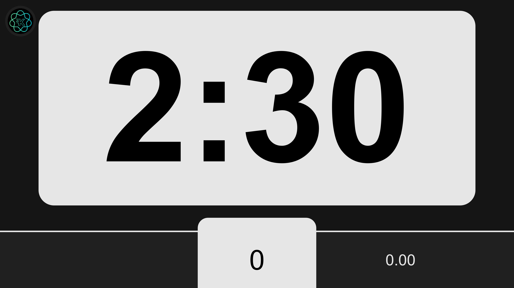
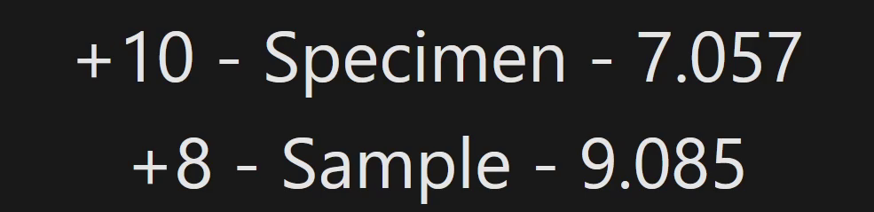
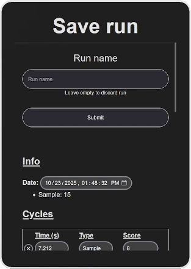
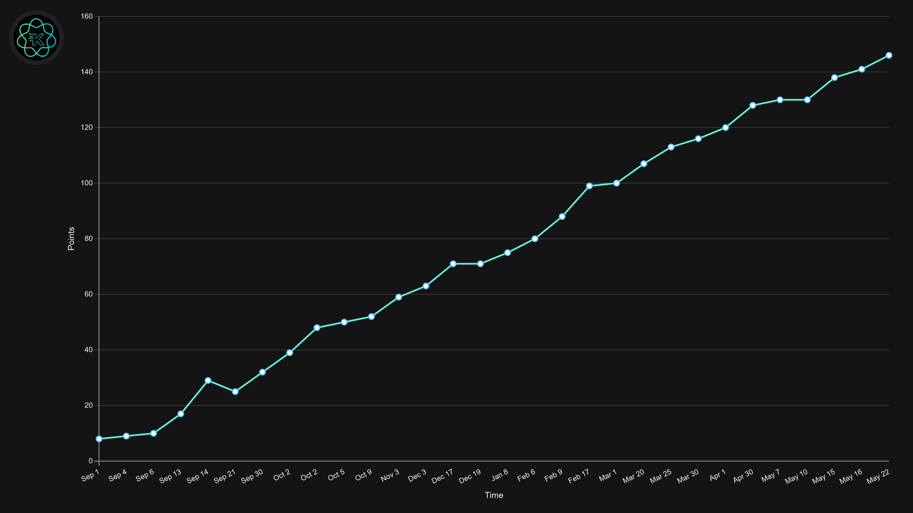
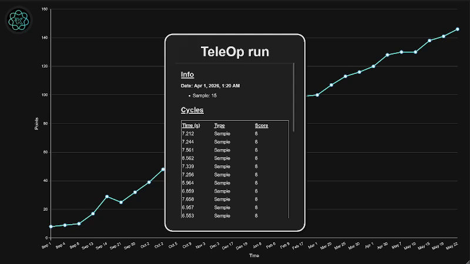
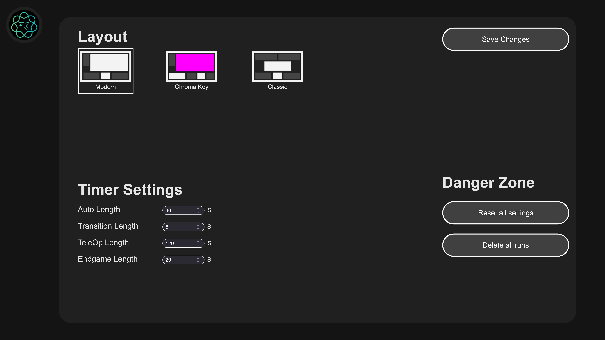
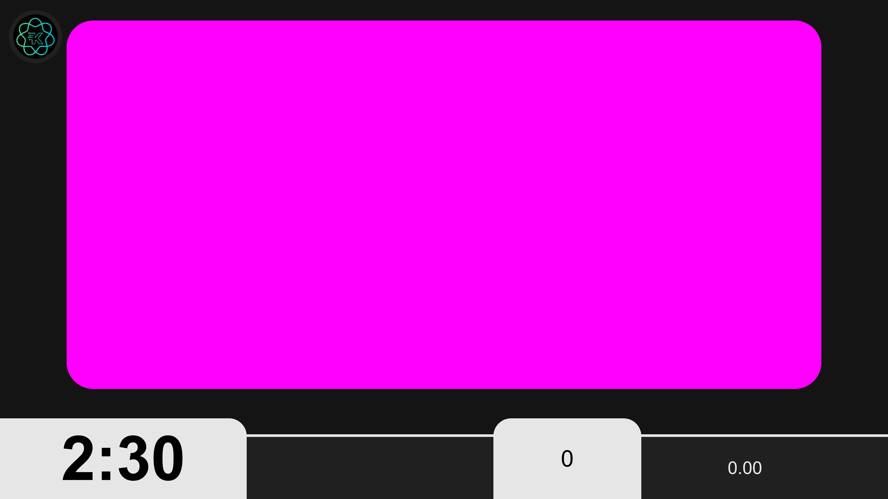

# FTC Practice App
[](https://jitpack.io/#22817-KNOTbot/ftc-practice-app)\
FTC Practice App is a web app designed to improve your driving performance

Developed by 22817 KNOTbot


# Features
## Key features
- Automatic score tracking - no human scorekeeper needed
- Easy to use interface with a design resembling real matches
- Record cycle times with millisecond precision
- Graph runs to watch improvement over time
- Designed to work regardless of the season's game
## Extra features
- Label runs with custom identifiable names and tags
- View advanced statistics including scoring rate and trends in cycle times
- Play real FTC match sounds
- Track starting matches too early or ending late
- Synchronize with multiple devices

- Record videos of your runs with live stats

# Installation
1. Open `build.dependencies.gradle` in the root of your project
2. Add `maven { url 'https://jitpack.io' }` at the bottom of the `repositories` section
```groovy
repositories {
	// ... other repositories

	maven { url 'https://jitpack.io' }
}
```
3. Add the practice app in the `dependencies` section
```groovy
depdencies {
	// ... other dependencies

	implementation 'com.github.22817-KNOTbot:ftc-practice-app:v1.0.0'
}
```

&nbsp;
# Usage
## Programming
All the functions you will need are static methods from the `Practice` class.

Start by importing the class:

```java
import com.knotbot.practiceapp.Practice;
```

&nbsp;\
When you start the match period, run the respective method
- `startAuto()` for Auto
- `startTransition()` for transition between Auto and TeleOp
- `startTeloOp()` for TeleOp

```java
// This example is for a LinearOpMode, but the same functions can be used similarly in an OpMode
@Override
public void runOpMode() {
	waitForStart();
	Practice.startAuto(); // If it is an Autonomous program, run this
	// Practice.startTeleop(); // If it is a TeleOp program, run this instead
}
```

For certain use cases, you may also want to call it during the init process

```java
@Override
public void runOpMode() {
	Practice.startTransition(); // Start the transition timer between Auto and TeleOp
	waitForStart();
	Practice.startTeleop(); // Start the TeleOp timer after pressing start
}
```

&nbsp;\
When scoring points, call the `addScore(score, name)` method, where score is the amount to add and name is the name of the scoring element. (Negative score values are allowed. The name is purely for your own reference and can be omitted)

```java
// When scoring a point, call the method

// Shoot an artifact
if (gamepad1.aWasPressed()) {
	shootArtifact(); // Include any code necessary to shoot an Artifact
	Practice.addScore(30, "Artifact"); // Add points for a classified Artifact
}

```

For autonomous points that should count again when starting TeleOp, just double the point value. This is to distinguish between other point types that should not double. The following example references the Into The Deep season, but can be adapted for any future season with similar scoring rules.

```java
// Hang a specimen
if (gamepad1.aWasPressed()) {
	openClaw(); // Include any code necessary to hang the specimen (from the Into The Deep season)
	Practice.addScore(20, "Specimen"); // Doubled to account for recount during TeleOp
}

// Park
if (gamepad1.xWasPressed()) { // You can use more complex logic such as odometry or timers instead
	Practice.addScore(3, "Park"); // Not doubled because parking points do not double
}
```

&nbsp;\
By default, the run will automatically end when you end the OpMode. If you want to run another OpMode, (for example, a TeleOp program after Auto,) you will need to disable auto end with the `setAutoEnd(autoEnd)` method. (Note that this value resets every time the robot restarts, so make sure to call this method each time)

```java
// This would be best to have in the init section of an Autonomous OpMode, though it can be put anywhere
Practice.setAutoEnd(false); // Disables auto ending
```

To end the run, use the `endRun()` method. This can be called in either Auto or TeleOp regardless of whether auto end is enabled or not.

```java
Practice.endRun(); // Ends the run
```

&nbsp;
### JavaDocs
All of the previously stated information is summarized in the JavaDocs of their respective methods. In Android Studio, hover over the method name to view the information directly in your editor.

&nbsp;
## Web interface
To access the web app, connect to the robot wifi and go to [http://192.168.43.1:8080/practice](http://192.168.43.1:8080/practice)

### Main page

This page is for viewing the live match. It includes the time, score, cycle timer, and recent changes in score.



&nbsp;\
While a match is active, sounds will play to imitate a real FTC game
> Note that if you would like to hear sounds, make sure to the click the page after opening it, otherwise no sounds will play.
> (This is a limitation of the browser, not the app)

&nbsp;\
The bottom left box will show changes in points and some other information. It will only show the 2 most recent events, but previous data will still be stored.



#### <ins>Ending a run</ins>

When the run ends, you will be shown a prompt to save the run. It includes all the run data that will be stored and a text box to input a name. The name will only be used for future identification and can be anything you want. You can also add tags, which let you filter runs later. If necessary, edit the run here to change what will be saved. For example, you can remove a scoring element that missed.



### Stats page

This page is for viewing the statistics of all recorded runs



Click on a point of the graph to show more information

This includes date, scoring cycles, and statistics

From here, you can also edit the data if necessary



#### <ins>Filtering</ins>

Filter runs by their tags in the filter box. Use this to see how different drivers, subsystems, or software systems compare.

### Settings

On this page, there are a number of things you can configure



#### <ins>Save changes</ins>
Make sure to save changes by clicking the "Save Changes" button on the top right

#### <ins>Layouts</ins>
You can choose between the 3 layouts: Modern, Chroma Key, and Classic.

| Modern | Chroma Key |
| ------ | ---------- |
| A minimalist design with an emphasis on only the most important information | Similar to the Modern design but includes a large frame for chroma keying (commonly known as green screen), allowing you to insert live video streams of your runs |
|  |  |
For instructions on chroma keying, check the wiki (coming soon).

#### <ins>Saving</ins>
Choose your own default name and tags that automatically apply to each run. You can still edit them on the normal save screen if necessary. The default name supports [date variables](https://cplusplus.com/reference/ctime/strftime/#:~:text=format,-C), which automatically use the current date and time.

#### <ins>Timer Settings</ins>
Customize the times for the timer here. Use this if the season's rules change the length of periods, or just to experiment with different times.

#### <ins>Mode</ins>
Change between the view and edit mode.

View: The default mode, allowing you to view the current run and live cycles as they happen\
Edit: A secondary mode which lets you edit the current run while it's still running. Use this to fix mistakes live or score anything that cannot be scored automatically.

#### <ins>Cycle Stats</ins>
Choose which stats you want to see while inspecting a run. You can find them on the run info screen on the stats page.

Available stats:
- Min
- Max
- Mean
- Median
- Secs/Point
- Points/Sec
- Std Dev
- Best 25% (cycle time)
- Worst 25% (cycle time)
- Best 10% (cycle time)
- Worst 10% (cycle time)

#### <ins>Danger Zone</ins>
This area contains buttons that make **permanent** changes. Pressing a button shows a confirmation box. After pressing confirm, you **cannot undo the action!**

### Edit Mode
This page lets you edit the current run as it's still running.\
The suggested usage is to have one device with a large display for the main timer page, visible to the drive team. A secondary device (such as a phone or another computer) would be on the edit mode to quickly make adjustments.

#### <ins>Enabling the Mode</ins>
The mode can be enabled/disabled in the settings page, under the Mode section.

#### <ins>Editing Current Run</ins>
The top table can be used to edit the current run while it is active. You can edit, remove, or insert a cycle. Make sure to press save at the bottom.

#### <ins>Manual Scoring</ins>
The bottom table can be used to manually score elements. Use this for anything that cannot be automatically scored. Enter the cycle information and press send. The information will stay on that device, even after reloads.\
Another possible use case is to put a negative score value, which could be used to remove the points of a missed scoring element

# Contributing
Feel free to contribute by making issues or pull requests.

If you encounter a bug or have a feature suggestion, create an [issue](../../issues)\
If you have a change to make, create a [pull request](../../pulls)

# Credits
This project was largely inspired by [FTC Dashboard](https://github.com/acmerobotics/ftc-dashboard)

# License
This project is open source and licensed under the [MIT License](LICENSE).